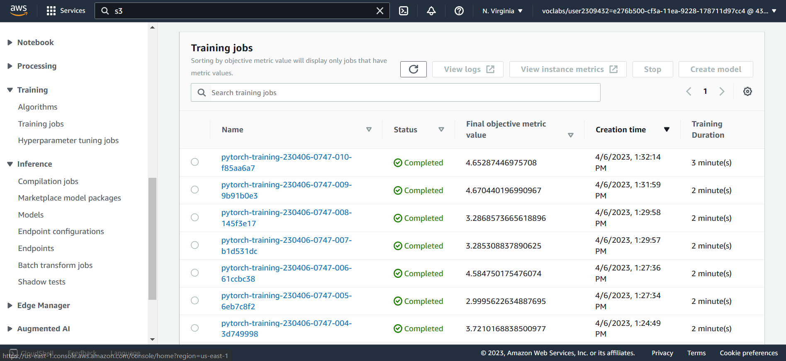
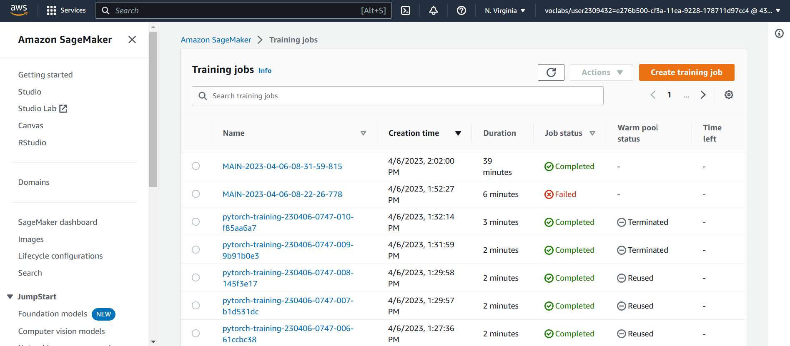
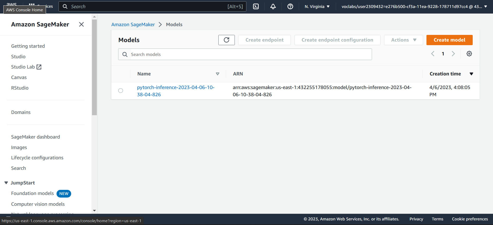
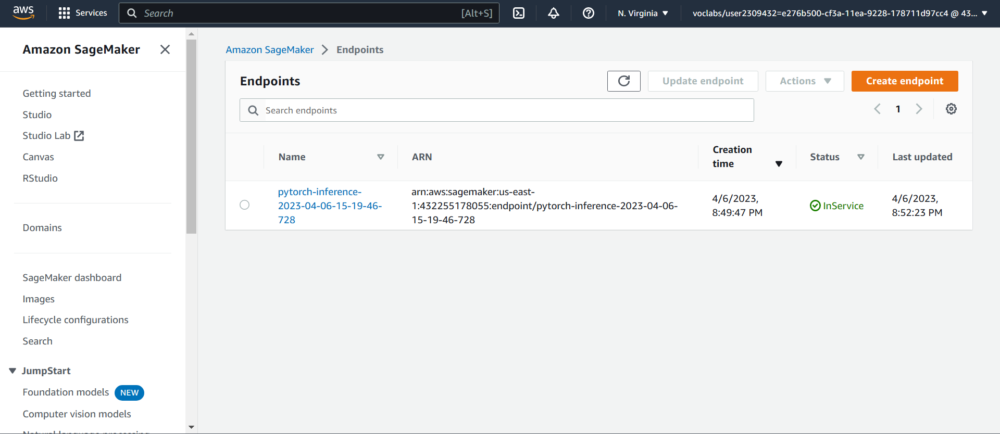

# Image Classification using AWS SageMaker

Use AWS Sagemaker to train a pretrained model that can perform image classification by using the Sagemaker profiling, debugger, hyperparameter tuning and other good ML engineering practices. This can be done on either the provided dog breed classication data set or one of your choice.

## Project Set Up and Installation
Enter AWS through the gateway in the course and open SageMaker Studio. 
Download the starter files.
Download/Make the dataset available. 

## Dataset
The provided dataset is the dogbreed classification dataset which can be found in the classroom.
The project is designed to be dataset independent so if there is a dataset that is more interesting or relevant to your work, you are welcome to use it to complete the project.

### Access
Upload the data to an S3 bucket through the AWS Gateway so that SageMaker has access to the data. 

## Hyperparameter Tuning
In this project, we utilize the ResNet50 model for the dog breed classification task. We used the hpo.py script to do hyperparameter search to discover the best settings for the learning rate and batch size. The learning rate was investigated over a continuous range of 0.001 to 0.1, whereas the batch size was investigated over a categorical range of 16, 32, 64, 128, 256, and 512.
Lastly, we trained the model for 20 epochs using the optimal parameters for the learning rate and batch size.

Below is the hyperparameter tuning task screenshot:

## Training

## Debugging and Profiling

We are debugging and analyzing a machine learning training job using Amazon SageMaker. We start by getting the name of the latest training job from an estimator object. Then, we use the SageMaker client to retrieve a description of the training job.

Next, we import the create_trial function from the smdebug.trials module and the ModeKeys enum from the smdebug.core.modes module. We use create_trial to create a trial object for the latest job's debugger artifacts path, which we then use to access information about the tensors and steps in the training job.

We then print the tensor names using the tensor_names() method of the trial object. Finally, we print the number of steps for the "CrossEntropyLoss_output_0" tensor in both train and evaluation modes using the len() function on the steps() method of the tensor object. And finally, we plot our output.

Next, we generate the Profiler output. First, it sets rule_output_path to the S3 output path for the latest training job's rule output. It then uses the AWS CLI to list the contents of that S3 path, and copies the files from that path to the local directory using the aws s3 cp command.

The code then sets profiler_report_name to the name of the rule configuration associated with the profiler output for the latest training job. It does this by filtering the rule job summaries for the latest job to find the first rule with "Profiler" in its name, and getting the configuration name for that rule.

Finally, the code uses the IPython.display.HTML() function to display the profiler report HTML file located at profiler_report_name + "/profiler-output/profiler-report.html". 

### Results
Some of the results provided by the profiler report was:

- The batch size is too small, and GPUs are underutilized. Consider running on a smaller instance type or increasing the batch size.	
- Check if there are bottlenecks, minimize blocking calls, change distributed training strategy, or increase the batch size
- Consider increasing the number of data loaders or applying data pre-fetching.	

**TODO** Remember to provide the profiler html/pdf file in your submission.

## Model Deployment
We are deploying a PyTorch model to an endpoint on Amazon SageMaker. First, we define jpeg_serializer and json_deserializer to serialize and deserialize the image data and prediction results.

Next, we define a custom predictor class ImagePredictor that extends the Predictor class and specifies the endpoint name, SageMaker session, serializer, and deserializer. We then create a PyTorchModel object using the estimator's model_data, IAM role, entry point, Python version, framework version, and predictor class.

We deploy the PyTorch model by calling the deploy() method on the pytorch_model object and specifying the number of initial instances and the instance type.

We then define a sample image URL in request_dict and download the image using the requests library. We then call the predict() method on the predictor object with the image data and initial arguments specifying the content type as image/jpeg.

Finally, we extract the predicted class label from the response using numpy.argmax() and display the image using the Pillow library's Image.open() function.

